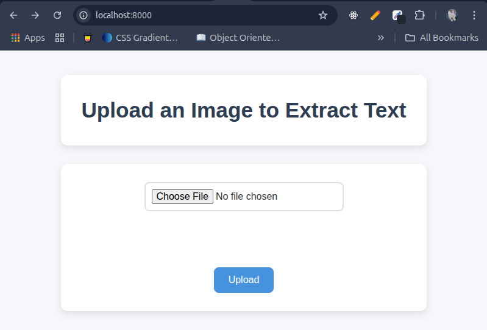
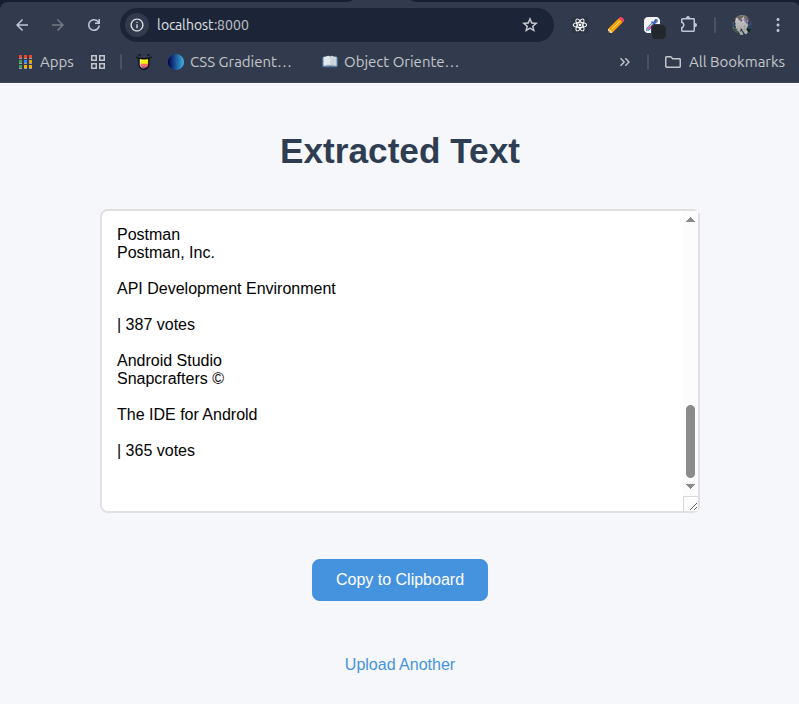

# 🖼️ Image to Text Converter (OCR Web App)

A simple Flask web application that extracts text from images using [Tesseract OCR](https://github.com/tesseract-ocr/tesseract), built without relying on third-party AI APIs. It includes a clean frontend UI, logging, clipboard support, and performance-enhancing preprocessing using Pillow.

---

## Deployed App
Try it out: [Live Demo](https://imagetotextapp-production.up.railway.app/)

---

## 🚀 Features

- 📤 Upload an image and extract text instantly
- 🧠 Image preprocessing with Pillow for better OCR accuracy
- 📋 Copy extracted text to clipboard with a single click
- ⏳ Loader animation while processing the image
- 📈 Access logging to count unique users by IP
- 📁 Organized file structure with templates, static assets, and logs

---

## 🗂️ Folder Structure

```

image-to-text-app/
│
├── app.py                  # Main Flask application
├── requirements.txt        # Python dependencies
├── logs/
│   └── access.log          # Tracks IPs for usage count
├── static/
│   ├── css/
│   │   └── style.css       # Styling for the web pages
│   ├── js/
│   │   └── script.js       # JS for clipboard functionality (optional)
│   └── uploads/            # Uploaded and processed images
├── templates/
│   ├── index.html          # Upload form with loader
│   └── result.html         # Displays extracted text and copy button

````

---

## 🛠️ Installation

### Prerequisites

- Python 3.6+
- [Tesseract OCR](https://github.com/tesseract-ocr/tesseract) installed and accessible in your PATH

### Install Dependencies

```bash
git clone https://github.com/kalminx/image-to-text-app.git
cd image-to-text-app
pip install -r requirements.txt
````

---

## ⚙️ Usage

```bash
python main.py
```

Visit `http://127.0.0.1:5000` in your browser.

---

## ✨ Planned Improvements

* 🔍 Integrate an AI-based OCR API (e.g., OpenAI Vision, Google OCR, etc.) as an option
* 📱 Mobile-first responsive UI
* 🧾 Export extracted text as `.txt` or `.pdf`
* 👤 Add user authentication (if expanded to multi-user SaaS)

---

## 📊 Usage Tracking

This app logs each visitor’s IP address to `logs/access.log`:

To count unique users:

```bash
cut -d ' ' -f 5 logs/access.log | sort | uniq | wc -l
```

Or programmatically in Python:

```python
def count_unique_ips():
    with open('logs/access.log') as f:
        return len(set(
            line.strip().split("Accessed by IP: ")[-1]
            for line in f if "Accessed by IP" in line
        ))
```

---

## 📷 Screenshot




---

## 🧪 Dependencies

* Flask
* Pillow
* pytesseract
* Tesseract OCR (external)

---

## 📝 License

MIT License. Use freely, modify, and build on it. Contributions welcome.

---

## 🙌 Acknowledgments

* Tesseract OCR by Google
* Flask Framework
